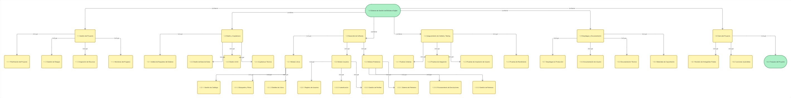

markdown
# 📚 Sistema de Gestión Bibliotecaria

## Descripción
Sistema para gestionar préstamos de libros en una biblioteca pública.

## Características
- ✅ Catálogo de libros
- ✅ Gestión de usuarios
- ✅ Control de préstamos y devoluciones
- ✅ Cálculo de multas por retraso

## Arquitectura
### Diagrama de Clases

## API Documentation
📖 [Especificación Swagger (OpenAPI)](docs/api/swagger.yaml)

## Guías
📘 [Guía de Instalación](docs/manual/INSTALACION.md)

## Equipo
- Desarrollado por: [Tu Nombre]
- Fecha: 2026

## Licencia
MIT

## 📋 Estructura de Desglose del Trabajo (EDT/WBS)

### Diagrama visual del proyecto

